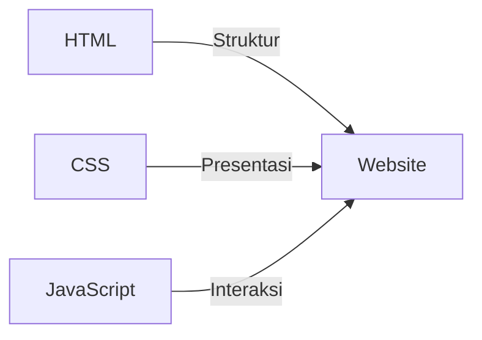
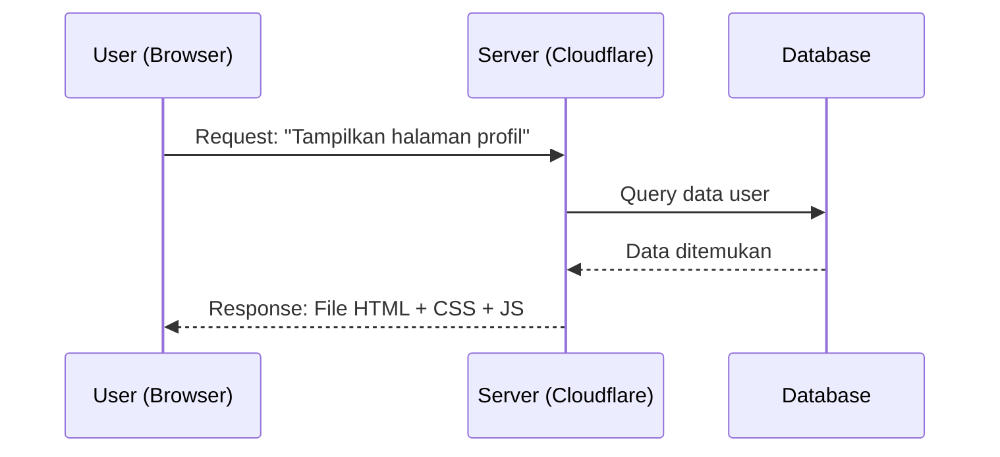

## 1. Tiga Pilar Utama Web
Setiap website di dunia, mulai dari blog sederhana hingga Facebook, dibangun di atas tiga teknologi fundamental:

1.  **HTML (HyperText Markup Language)**: Ibarat **kerangka manusia**. Ia menentukan di mana letak judul, gambar, dan paragraf.
2.  **CSS (Cascading Style Sheets)**: Ibarat **kulit, baju, dan riasan**. Ia menentukan warna, ukuran font, dan tata letak agar terlihat cantik.
3.  **JavaScript**: Ibarat **otot dan sistem saraf**. Ia membuat website bisa "berpikir" dan merespons tindakan pengguna (klik tombol, form validasi, dll).

---

## 2. Model Client-Server
Memahami cara internet bekerja adalah kunci menjadi engineer yang hebat.

-   **Client**: Perangkat Anda (Laptop/HP) yang meminta data melalui Browser.
-   **Server**: Komputer di tempat jauh (misal: Cloudflare) yang menyimpan file website dan memproses permintaan Anda.
-   **Database**: Tempat penyimpanan data permanen (seperti username, password, dan progres belajar).

---

## 3. Konsep Frontend vs Backend
-   **Frontend**: Segala sesuatu yang **Anda lihat** dan sentuh di layar. (HTML, CSS, React, Tailwind).
-   **Backend**: "Dapur" di balik layar yang menangani logika, keamanan, dan data. (Node.js, SQL, API).
-   **Fullstack**: Seseorang yang menguasai keduanya.

---

## 4. Mental Model: Vibe Coding & AI
Di era 2026, Anda tidak harus menghafal semua sintaks. Mental model Anda harus berubah:
-   **Pahami Logika**: AI bisa menulis kode, tapi Anda harus tahu **apa** yang harus diminta.
-   **Debug Mastery**: Pahami cara kerja kode agar bisa memperbaiki kesalahan yang dibuat AI.
-   **Arsitektur Pertama**: Fokus pada bagaimana komponen saling terhubung, biarkan AI menangani penulisan baris kodenya.

---

## Knowledge Check
- [ ] Sebutkan 3 pilar utama teknologi web.
- [ ] Apa perbedaan mendasar antara Frontend dan Backend?
- [ ] Mengapa pemahaman arsitektur lebih penting daripada menghafal sintaks di era AI?
