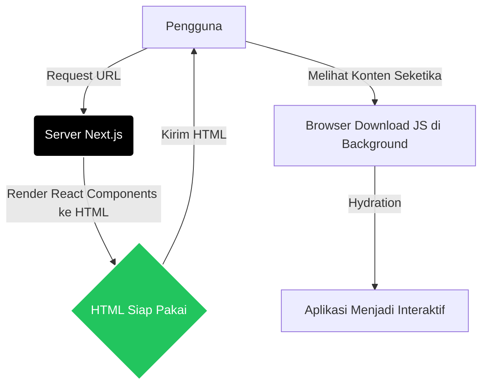

Selamat datang di tingkatan *Expert*! Di modul-modul sebelumnya, Anda telah membangun fondasi yang sangat kuat dengan HTML, CSS, JavaScript, dan React. Anda juga sudah memahami konsep dasar backend, API, dan database. Sekarang, saatnya menggabungkan semua kekuatan tersebut ke dalam satu wadah yang digunakan oleh perusahaan-perusahaan teknologi terkemuka di dunia: **Next.js**.

Materi ini dirancang sebagai sebuah *Masterclass*. Anda akan menemukan pembahasan yang sangat mendalam mengenai arsitektur Next.js. Mari kita mulai perjalanan menjadi seorang *Fullstack Modern Engineer*.

## Mengapa Kita Butuh Framework di Atas Framework?

React adalah sebuah *library* yang luar biasa untuk membangun antarmuka pengguna (UI). Namun, React memiliki beberapa batasan ketika digunakan murni untuk aplikasi berskala besar (sering disebut sebagai Single Page Applications atau SPA). 

### Masalah pada Aplikasi React Murni (CSR)
Ketika Anda membangun aplikasi menggunakan React murni (Client-Side Rendering / CSR), proses yang terjadi adalah:
1. Pengguna membuka URL website.
2. Server mengirimkan file HTML kosong beserta file JavaScript yang sangat besar.
3. Browser pengguna mengunduh file JavaScript tersebut.
4. Browser mengeksekusi JavaScript, dan barulah UI dirender di layar.

Ada dua kelemahan utama dari pendekatan ini:
- **SEO (Search Engine Optimization) yang Buruk:** Saat *crawler* mesin pencari (seperti Googlebot) datang, mereka hanya melihat HTML kosong. Walaupun Googlebot kini bisa mengeksekusi JavaScript, prosesnya lambat dan tidak optimal.
- **Performa Awal (Initial Load) yang Lambat:** Pengguna harus menunggu seluruh bundel JavaScript diunduh dan dieksekusi sebelum mereka bisa melihat apa pun. Pada koneksi internet lambat atau perangkat spesifikasi rendah, pengguna hanya akan melihat layar putih untuk waktu yang cukup lama.

### Solusinya: Next.js
Next.js hadir sebagai framework yang dibangun *di atas* React untuk menyelesaikan masalah tersebut. Next.js memperkenalkan konsep **Server-Side Rendering (SSR)** dan **Static Site Generation (SSG)** secara bawaan (*out-of-the-box*).



Dengan Next.js, HTML sudah dirakit di server *sebelum* dikirim ke browser pengguna. Pengguna langsung melihat konten seketika (SEO sangat bagus), dan kemudian JavaScript akan dimuat di latar belakang untuk membuat halaman tersebut menjadi interaktif (proses ini disebut *Hydration*).

## Mengenal App Router: Revolusi Arsitektur

Pada tahun 2023, Next.js merilis versi 13 yang memperkenalkan **App Router**, sebuah revolusi besar dalam cara kita menstrukturkan aplikasi web. App Router menggunakan sistem *File-System Based Routing* yang sangat kuat di dalam folder `app`.

Setiap folder di dalam folder `app` mewakili sebuah segment rute pada URL.

### Konvensi File Khusus (Special Files)

App Router tidak menggunakan nama file sembarangan. Ia memiliki konvensi file khusus untuk mendefinisikan perilaku UI:

1. `page.tsx`: Digunakan untuk mendefinisikan UI dari sebuah rute yang dapat diakses secara publik.
2. `layout.tsx`: Digunakan untuk mendefinisikan UI yang dibagikan (dibungkus) melintasi beberapa halaman, seperti Header dan Footer. Layout akan mempertahankan state dan tidak merender ulang saat pengguna berpindah halaman.
3. `loading.tsx`: Menampilkan UI pemuatan (seperti spinner atau skeleton) sementara konten asli sedang diambil dari database.
4. `error.tsx`: Menangani error secara spesifik pada rute tersebut tanpa merusak seluruh aplikasi.

```text
app/
├── layout.tsx         # Layout Utama (diaplikasikan ke semua halaman)
├── page.tsx           # Halaman Home ( / )
├── loading.tsx        # UI Loading untuk Home
├── error.tsx          # Error handler untuk Home
│
└── dashboard/         # Rute ( /dashboard )
    ├── layout.tsx     # Layout khusus Dashboard (Sidebar, dll)
    ├── page.tsx       # Halaman Dashboard utama
    │
    └── settings/      # Rute ( /dashboard/settings )
        └── page.tsx   # Halaman Pengaturan
```

Arsitektur ini membuat pemisahan kode (*Code Splitting*) menjadi sangat otomatis dan efisien. Jika Anda berada di halaman Home, kode untuk halaman Dashboard tidak akan pernah dimuat.

## React Server Components (RSC) vs Client Components

Ini adalah konsep paling vital untuk dikuasai di era web modern. Secara *default*, semua komponen di dalam App Router Next.js adalah **React Server Components (RSC)**.

### Apa itu Server Components?
Server Components adalah komponen React yang dieksekusi, dirender, dan menyelesaikan tugasnya **hanya di server**. Kode dari Server Components tidak akan pernah dikirim ke browser pengguna.

**Keunggulan Server Components:**
- **Ukuran Bundle JavaScript Nol (Zero Bundle Size):** Pustaka berat (seperti pustaka pemformatan tanggal `moment.js` atau pustaka markdown) yang digunakan di Server Component tidak akan membebani browser pengguna. Browser hanya menerima hasil akhir berupa HTML statis.
- **Akses Langsung ke Backend:** Anda dapat melakukan *query* langsung ke database atau membaca file system lokal tepat di dalam komponen Anda secara aman karena kode ini berjalan di lingkungan server Node.js.
- **Keamanan:** Kredensial rahasia (seperti API Keys atau String Koneksi Database) dijamin tidak akan pernah bocor ke sisi klien.

```tsx language-typescript
// Contoh sebuah Server Component (page.tsx)
// Komponen ini akan berjalan di server

import db from '@/lib/db'; // Mengambil instance database

export default async function DaftarPengguna() {
  // Kita bisa langsung mengambil data dari database di dalam komponen!
  const users = await db.query('SELECT * FROM users');

  return (
    <div>
      <h1>Daftar Pengguna Sistem</h1>
      <ul>
        {users.map(user => (
          <li key={user.id}>{user.name} - {user.email}</li>
        ))}
      </ul>
    </div>
  );
}
```

### Apa itu Client Components?
Tentu saja, kita masih membutuhkan interaktivitas. Tombol yang bisa diklik, form input, animasi, atau penggunaan `useState` dan `useEffect` membutuhkan lingkungan browser. Di sinilah **Client Components** berperan.

Untuk membuat sebuah Client Component, Anda harus secara eksplisit menempatkan direktif `"use client"` di baris paling atas dari file komponen Anda.

```tsx language-typescript
// Contoh Client Component (Button.tsx)
"use client"; // Ini menandakan komponen berjalan di browser

import { useState } from 'react';

export default function CounterButton() {
  const [count, setCount] = useState(0);

  return (
    <button 
      onClick={() => setCount(count + 1)}
      className="bg-blue-500 text-white px-4 py-2 rounded"
    >
      Diklik {count} kali
    </button>
  );
}
```

**Aturan Emas Server vs Client Components:**
1. Gunakan Server Components (*default*) untuk mengambil data, mengakses database, menampilkan informasi statis, dan struktur layout utama.
2. Gunakan Client Components (menggunakan `"use client"`) **hanya** pada bagian-bagian kecil (seperti tombol, form, modal) yang membutuhkan interaktivitas langsung dari pengguna atau menggunakan *State/Hooks*.
3. Jangan menaruh `"use client"` di komponen akar (root) seperti halaman utama, karena itu akan menghilangkan semua keuntungan performa dari Server Components.

## Cara Modern Data Fetching

Di masa lalu, dalam aplikasi React murni, Anda biasanya menggunakan `useEffect` untuk mengambil data saat halaman dimuat.

```tsx language-typescript
// CARA LAMA (React Murni CSR - Dihindari di Next.js Modern)
import { useEffect, useState } from 'react';

function UserProfile() {
  const [data, setData] = useState(null);
  const [loading, setLoading] = useState(true);

  useEffect(() => {
    fetch('/api/user/1')
      .then(res => res.json())
      .then(result => {
        setData(result);
        setLoading(false);
      });
  }, []);

  if (loading) return <div>Loading...</div>;
  return <div>{data.name}</div>;
}
```

Cara di atas buruk untuk performa karena terjadinya *Waterfalls* jaringan dan hilangnya SEO. 

### Pendekatan Next.js App Router (Server-Side Fetching)

Di Next.js, fungsi komponen Anda bisa bersifat `async`, memungkinkan Anda untuk `await` pengambilan data langsung sebelum komponen tersebut mengirimkan HTML ke klien.

```tsx language-typescript
// CARA MODERN (Next.js Server Component)

// Komponen Async!
export default async function UserProfile() {
  // Pengambilan data terjadi di server secara instan
  const res = await fetch('https://api.example.com/user/1');
  const data = await res.json();

  // HTML yang dihasilkan sudah berisi nama pengguna. SEO Sempurna!
  return (
    <div className="p-4 border rounded">
      <h2>Profil Pengguna</h2>
      <p>Nama: {data.name}</p>
      <p>Email: {data.email}</p>
    </div>
  );
}
```

Kode di atas jauh lebih bersih, tidak membutuhkan *state* pemuatan manual, dan jauh lebih cepat.

## Caching dan Revalidation yang Cerdas

Ketika Anda menggunakan `fetch()` di Server Components, Next.js secara otomatis melakukan **Caching** pada hasil permintaan tersebut. Artinya, jika 1000 orang membuka halaman secara bersamaan, Next.js mungkin hanya melakukan panggilan ke API sebanyak satu kali, dan memberikan hasil dari *cache* memori untuk 999 orang lainnya. Ini membuat server sangat hemat biaya.

Namun, bagaimana jika data tersebut dinamis dan berubah? Next.js menyediakan **Revalidation** (Validasi Ulang).

### Time-Based Revalidation (Validasi Berbasis Waktu)
Anda dapat mengatur agar data di-*cache* selama waktu tertentu.

```tsx language-typescript
// Mengambil data cuaca, revalidasi cache setiap 60 detik
const res = await fetch('https://api.cuaca.com/jakarta', {
  next: { revalidate: 60 } // Waktu dalam detik
});
```
Dengan kode di atas, meskipun halaman diakses ribuan kali dalam satu menit, API eksternal hanya akan dipanggil satu kali setiap 60 detik. Hal ini dikenal dengan nama *Incremental Static Regeneration* (ISR).

## Server Actions: Revolusi Mutasi Data

Sebelum Next.js 14, ketika Anda ingin mengirim data form ke database, Anda harus:
1. Membuat API Endpoint (`/api/submit-form`).
2. Membuat form di React (Client Component).
3. Menggunakan fungsi `fetch` atau `axios` untuk mengirim POST request ke API tersebut.
4. Menangani status loading dan error.

Ini adalah proses yang sangat membosankan dan berulang-ulang (disebut *Boilerplate*). Next.js memperkenalkan **Server Actions**, cara untuk mengeksekusi kode di sisi server secara langsung dari fungsi yang dipanggil pada sisi klien.

### Menggunakan Server Actions dalam Form

```tsx language-typescript
// src/app/guestbook/page.tsx
import { revalidatePath } from 'next/cache';
import db from '@/lib/db'; // Asumsi ini koneksi database kita

export default async function Guestbook() {
  const entries = await db.query('SELECT * FROM guestbook');

  // INI ADALAH SERVER ACTION
  // Fungsi ini akan dieksekusi sepenuhnya di server secara aman
  async function addEntry(formData: FormData) {
    "use server"; // Direktif penanda Server Action
    
    // Mengekstrak data dari form
    const message = formData.get('message');
    
    // Menyimpan langsung ke database
    await db.query(`INSERT INTO guestbook (message) VALUES ('${message}')`);
    
    // Menyuruh Next.js menghapus cache halaman ini agar data baru muncul
    revalidatePath('/guestbook');
  }

  return (
    <div className="max-w-md mx-auto p-4">
      <h1 className="text-2xl font-bold mb-4">Buku Tamu</h1>
      
      {/* Form ini memanggil fungsi addEntry saat disubmit! Tanpa membuat rute API! */}
      <form action={addEntry} className="mb-8 flex gap-2">
        <input 
          type="text" 
          name="message" 
          placeholder="Tinggalkan pesan..." 
          className="border p-2 rounded flex-1 text-black"
          required
        />
        <button type="submit" className="bg-black text-white px-4 py-2 rounded font-bold">
          Kirim
        </button>
      </form>

      <ul className="space-y-2">
        {entries.map(entry => (
          <li key={entry.id} className="p-3 bg-gray-100 rounded text-black">
            {entry.message}
          </li>
        ))}
      </ul>
    </div>
  );
}
```

Hanya dengan beberapa baris kode, kita telah membuat sistem *Fullstack* (membaca data dan menulis data) tanpa perlu membuat API endpoint satu pun! Inilah mengapa framework seperti Next.js sering disebut sebagai "Fullstack Framework".

## Praktik Keamanan (Security Consideration)

Ketika bekerja dengan komponen yang bisa langsung mengakses database atau membaca file sensitif, Anda harus sangat berhati-hati agar tidak secara tidak sengaja membocorkan fungsi server ke klien.

1. **Selalu gunakan `"use server"`** untuk fungsi Server Actions. Jika lupa, fungsi tersebut mungkin berusaha dieksekusi di browser, yang akan menyebabkan error karena browser tidak memiliki akses ke pustaka Node.js seperti `fs` atau `database-driver`.
2. **Validasi Input:** Server Action menerima masukan dari pengguna (via form). Sama seperti API tradisional, Anda HARUS selalu memvalidasi input tersebut. Pengguna yang usil bisa mengirimkan data berbahaya yang menyebabkan *SQL Injection* jika Anda tidak berhati-hati. Gunakan library seperti `Zod` untuk memvalidasi *schema* input.

## Kesimpulan

Next.js App Router telah merombak cara kita membangun aplikasi web. Dengan memanfaatkan **Server Components** untuk struktur yang cepat dan ramah SEO, **Client Components** untuk interaktivitas, dan **Server Actions** untuk operasi database tanpa batas, Anda dapat membangun aplikasi setingkat *Enterprise* dengan kecepatan pengembangan (Developer Experience) yang tak tertandingi.

Memahami garis batas antara Server dan Client adalah keterampilan paling fundamental yang membedakan seorang React Developer biasa dengan seorang Next.js Expert. Teruslah bereksperimen dengan kombinasi keduanya.
