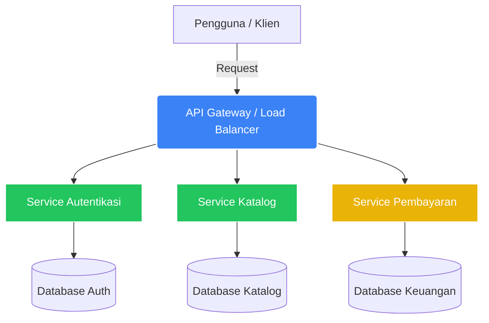
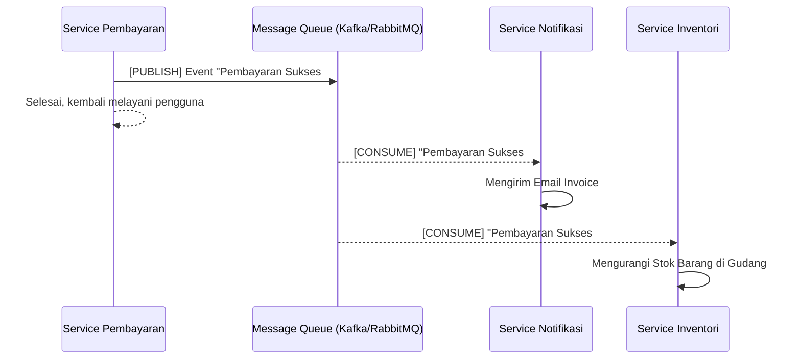

Di fase-fase awal, ketika Anda membangun aplikasi (seperti aplikasi To-Do atau E-Commerce sederhana), Anda biasanya meletakkan seluruh kode—dari routing UI, pengelolaan produk, hingga pembayaran—di dalam satu tempat. Basis data (*database*) yang digunakan pun hanya satu. Pola seperti ini sangat umum dan dikenal sebagai arsitektur **Monolithic**.

Namun, bagaimana ketika aplikasi Anda menjadi sangat populer seperti Tokopedia atau Netflix yang memiliki jutaan pengguna aktif setiap saat? Sebuah server Monolithic tidak akan mampu menanganinya. Modul ini akan membuka wawasan Anda tentang bagaimana *Software Engineers* di perusahaan besar merancang arsitektur sistem mereka.

## 1. Monolithic vs Microservices

Mari kita mulai dengan memahami dua kutub arsitektur sistem yang paling mendasar.

### Arsitektur Monolithic (Monolit)
Dalam aplikasi Monolit, semua fitur (misal: Autentikasi, Katalog, Keranjang Belanja, dan Pembayaran) digabungkan dalam satu basis kode (codebase) dan dijalankan pada server yang sama, menggunakan *database* yang sama.

**Keuntungan Monolit:**
- **Sederhana:** Sangat mudah untuk dikembangkan di tahap awal (startup).
- **Deployment Mudah:** Hanya perlu me-deploy satu folder proyek ke satu server (misalnya menggunakan Vercel atau Heroku).
- **Debugging Terpusat:** Melacak *error* sangat mudah karena semua kode saling terhubung secara langsung.

**Kelemahan Monolit (Ketika Skala Membesar):**
- **Risiko Kegagalan Total (Single Point of Failure):** Jika fitur "Keranjang Belanja" mengalami *bug* yang menyebabkan memori penuh, maka seluruh aplikasi (termasuk fitur Autentikasi dan Katalog) akan ikut mati (crash).
- **Scaling Tidak Efisien:** Jika trafik aplikasi sedang tinggi hanya di bagian fitur "Pembayaran" karena sedang ada promo, Anda harus menduplikasi seluruh kode (termasuk Katalog dan Autentikasi) ke server baru, yang mana memakan banyak *resource* secara percuma.

### Arsitektur Microservices (Layanan Mikro)
Microservices adalah pendekatan arsitektur di mana sebuah aplikasi besar dipecah menjadi layanan-layanan kecil yang independen. Setiap layanan (service) fokus pada satu tugas spesifik (misalnya Service Pembayaran sendiri, Service Pengguna sendiri) dan masing-masing memiliki *database* sendiri.

**Keuntungan Microservices:**
- **Resiliensi Tinggi:** Jika *Service Pembayaran* mati/down, pengguna tetap bisa login dan melihat *Katalog* produk.
- **Scaling Independen:** Jika trafik katalog sedang tinggi, kita hanya perlu menambah *server* khusus untuk *Service Katalog* saja tanpa menyentuh *service* lainnya.
- **Fleksibilitas Teknologi:** Tim Autentikasi bisa menggunakan Node.js, sementara tim Pembayaran bisa menggunakan bahasa Go atau Python jika dirasa lebih aman dan cepat.

**Kelemahan Microservices:**
- **Kompleksitas Operasional:** Anda sekarang harus me-deploy dan mengawasi banyak server.
- **Kompleksitas Komunikasi:** Layanan-layanan ini berjalan di komputer yang berbeda, sehingga mereka harus berkomunikasi melalui jaringan (Network). Ini sering kali memunculkan masalah jeda (*latency*).

> **Peringatan Ahli:** Jangan mulai dengan Microservices kecuali Anda benar-benar membutuhkannya. Kompleksitasnya bisa memperlambat tim Anda. Pendekatan terbaik adalah: *Mulai dengan Monolit, lalu pecah menjadi Microservices secara bertahap saat sistem mulai kewalahan.*

## 2. Pola Komunikasi Antar Service

Ketika Anda memecah aplikasi menjadi beberapa *services*, mereka harus tetap "ngobrol" satu sama lain. Contoh: Ketika *Service Pembayaran* berhasil memproses transaksi, ia harus memberi tahu *Service Notifikasi* untuk mengirimkan email resi kepada pengguna.

Ada tiga pola komunikasi utama di arsitektur modern:

### A. REST API (Representational State Transfer)
Ini adalah pola yang paling umum, menggunakan protokol HTTP. Layanan A mengirim *request* POST/GET ke Layanan B, dan Layanan B membalas dengan JSON.
- **Sifat:** Sinkron (*Synchronous*). Layanan A akan menunggu sampai Layanan B selesai merespons sebelum melanjutkan tugasnya.
- **Kelemahan:** Jika Layanan B lambat, Layanan A juga akan melambat.

### B. gRPC (Google Remote Procedure Call)
Diciptakan oleh Google, gRPC menggunakan protokol HTTP/2 dan format *Protocol Buffers* (Protobuf) yang berbentuk data *binary*.
- **Keunggulan:** Sangat ringan dan secepat kilat (bisa 10x lebih cepat dari REST API). Ideal untuk komunikasi internal antar *server* ke *server*.

### C. Message Queues & Event-Driven Architecture (Asynchronous)
Ini adalah solusi terbaik untuk mencegah penumpukan (bottleneck). Menggunakan sistem *Message Broker* seperti **RabbitMQ** atau **Apache Kafka**.

- **Sifat:** Asinkron (*Asynchronous*). Layanan A tidak menembak langsung ke Layanan B. Layanan A hanya melempar "Pesan" ke dalam Kotak Pos (Message Queue).
- **Proses:** Misalnya pesannya adalah "Pesanan #123 Telah Dibayar". Layanan A langsung selesai dan bisa melayani *user* lain. Sementara itu, *Service Notifikasi* dan *Service Inventori* yang sedang berjaga, akan mengambil pesan tersebut dari Kotak Pos untuk diproses di waktu senggang mereka.

Sistem berbasis *Message Queue* memastikan bahwa jika *Service Notifikasi* kebetulan mati, pesannya tidak akan hilang. Pesan akan tetap tersimpan di dalam antrean (*queue*) sampai *service* tersebut hidup kembali.

## 3. Konsep Inti Skalabilitas (Scaling)

Bagaimana kita membuat sistem bisa melayani jutaan pengguna? Jawabannya ada pada strategi *Scaling*.

### Vertical Scaling vs Horizontal Scaling
1. **Vertical Scaling (Scaling Up):** Menambah "Otot" pada satu server. Jika server Anda RAM-nya 4GB, Anda *upgrade* menjadi 32GB atau 128GB. 
   - **Kelemahan:** Ada batas fisik seberapa kuat satu komputer bisa ditingkatkan. Serta, saat melakukan *upgrade*, server biasanya harus dimatikan sejenak (Downtime).
2. **Horizontal Scaling (Scaling Out):** Menambah jumlah "Pekerja" (Server). Alih-alih menggunakan satu server super, kita menggunakan puluhan atau ratusan server murah secara bersamaan.
   - **Keunggulan:** Tidak ada batas maksimal. Jika pengguna bertambah, tinggal tambah server baru. Inilah tulang punggung dari komputasi awan (*Cloud Computing*).

### Menggunakan Load Balancer (Penyeimbang Beban)
Jika kita memiliki 5 server identik (Horizontal Scaling), bagaimana komputer pengguna tahu harus menghubungi server yang mana? Jawabannya adalah **Load Balancer**.

Load Balancer (seperti NGINX, HAProxy, atau AWS Application Load Balancer) bertindak sebagai resepsionis gedung. 
1. Pengguna selalu mengirim *request* ke IP Load Balancer.
2. Load Balancer melihat catatan "Oh, Server 1 sedang sibuk, mari kita oper request ini ke Server 2 yang sedang santai."
3. Load Balancer mendistribusikan *traffic* secara merata ke semua server.

## 4. Keamanan Arsitektur: Rate Limiting & Redundancy

Skalabilitas juga erat kaitannya dengan keamanan dan ketersediaan layanan (*Availability*).

### Rate Limiting (Pembatasan Laju)
Serangan DDoS (*Distributed Denial of Service*) terjadi ketika peretas menggunakan jutaan komputer bot (zombie) untuk mengirimkan *request* ke server Anda secara bersamaan dengan tujuan membuat server tersebut meledak atau mati.

*Rate Limiting* adalah teknik pertahanan pertama. Konsepnya sederhana: **Membatasi jumlah aksi yang boleh dilakukan oleh satu pengguna (satu alamat IP) dalam rentang waktu tertentu.**
Misalnya: "Alamat IP X hanya boleh melakukan request maksimal 100 kali per menit." Jika lebih dari itu, sistem akan mengembalikan pesan error `HTTP 429 Too Many Requests`.

Dalam arsitektur *microservices*, Rate Limiting sering diimplementasikan di gerbang utama (API Gateway) menggunakan bantuan memori caching secepat kilat, yaitu **Redis**.

### Redundancy & High Availability (Ketersediaan Tinggi)
Dalam dunia *Engineering*, hukum Murphy berlaku: "Apa yang bisa salah, akan salah." Hardisk akan rusak, kabel optik bawah laut akan putus tersangkut jangkar kapal, atau data center akan mati lampu.

**Redundancy** (Redundansi) adalah strategi membuat duplikat dari sistem Anda agar tidak ada *Single Point of Failure* (Satu titik yang jika mati menghancurkan segalanya).
- **Server Redundancy:** Minimal jalankan dua server di belakang Load Balancer. Jika satu mati, server kedua mengambil alih tanpa *downtime*.
- **Database Replication:** Selalu miliki database utama (*Primary/Master* yang menerima fungsi tulis/Write) dan database replika (*Secondary/Slave* yang membaca/Read data dari Master). Jika database Master mati, database Replica bisa diangkat menjadi Master baru dalam hitungan detik.
- **Geographic Redundancy:** Perusahaan besar biasanya mereplikasi seluruh arsitekturnya di pusat data (*Data Center*) yang berbeda benua. Jika benua Asia mengalami bencana internet, *traffic* akan dialihkan sementara ke *Data Center* di Eropa.

## Kesimpulan

Beralih dari pembuat website (Developer) menjadi Perancang Sistem (*Systems Architect*) membutuhkan pergeseran sudut pandang. Anda tidak lagi hanya memikirkan "Apakah kode saya menghasilkan UI yang benar?", melainkan mulai berpikir "Bagaimana jika ada satu juta orang yang mengklik tombol ini secara bersamaan di detik yang sama?".

Pemahaman akan Load Balancing, Messaging Queues, Caching, dan transisi menuju Microservices adalah modal utama bagi *engineer* untuk merancang arsitektur perangkat lunak kelas dunia.
