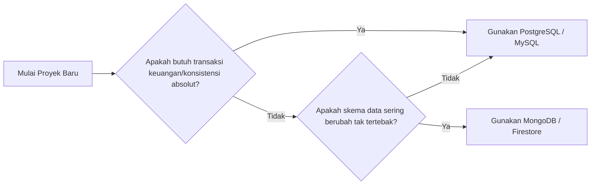

Data adalah detak jantung dari hampir semua aplikasi modern. Di Modul 8, Anda telah mempelajari dasar-dasar SQL dan konsep CRUD. Di tingkatan *Expert* ini, kita tidak hanya akan menyimpan data; kita akan mempelajari arsitektur data, strategi pemilihan database, dan bagaimana tim profesional berinteraksi dengan database menggunakan perkakas modern seperti ORM (*Object-Relational Mapping*).

## 1. Perang Database: Relasional (SQL) vs Non-Relasional (NoSQL)

Ketika memulai proyek baru, pertanyaan arsitektural pertama yang sering muncul adalah: "Database apa yang harus kita gunakan?"

Sering kali *developer* pemula memilih MongoDB karena "terlihat mudah dengan JSON", atau memilih MySQL karena "itu yang diajarkan di kampus". Pendekatan ini berbahaya di skala enterprise. Keputusan database harus didorong oleh **Bentuk Data (Data Shape)** dan **Pola Akses (Access Patterns)**.

### Relational Database (SQL)
Contoh Populer: PostgreSQL, MySQL, SQLite, Cloudflare D1.

SQL menyimpan data dalam bentuk tabel yang terstruktur erat, terdiri dari baris dan kolom. Kekuatan utamanya terletak pada **Relasi** antar tabel (misalnya: Tabel `Users` berelasi dengan Tabel `Orders`).

**Keunggulan Utama (ACID Properties):**
SQL menjamin *Atomicity, Consistency, Isolation, dan Durability*. Artinya, jika ada transaksi transfer uang, SQL menjamin bahwa jika pemotongan saldo di akun A berhasil tetapi penambahan saldo di akun B gagal karena mati lampu, maka seluruh transaksi dibatalkan (*Rollback*). Uang tidak akan pernah hilang di tengah jalan. Inilah mengapa perbankan dan *E-commerce* hampir selalu menggunakan SQL.

**Kapan menggunakan SQL?**
- Ketika skema data Anda sangat jelas dan jarang berubah bentuknya (Contoh: Profil Pengguna pasti butuh nama, email, password).
- Anda butuh transaksi yang sangat konsisten (Pembayaran, Sistem Inventori).
- Anda perlu melakukan pelaporan (Reporting) yang sangat rumit menggunakan perintah `JOIN` antar 5 tabel berbeda.

### Non-Relational Database (NoSQL)
Contoh Populer: MongoDB, Redis, DynamoDB, Firestore.

NoSQL (sering juga berarti *Not Only SQL*) menyimpan data tidak dalam bentuk tabel, melainkan dalam bentuk Dokumen (seperti JSON), Key-Value, Graph, atau Column-Family.

**Kapan menggunakan NoSQL?**
- **Data Tidak Terstruktur (Unstructured Data):** Misalnya Anda membuat sistem *Log Server* atau *Analytics*. Satu kejadian (*event*) mungkin memiliki 5 atribut data, kejadian lain mungkin memiliki 20 atribut berbeda. Skema yang fleksibel sangat cocok di sini.
- **Kecepatan Baca/Tulis Tertinggi (High Throughput):** Database tipe *Key-Value* seperti **Redis** menyimpan datanya di RAM (bukan Hardisk), sehingga kecepatannya sekelas mikro-detik. Sangat cocok untuk *Caching* atau Sistem Chat.
- **Skalabilitas Horizontal Cepat:** NoSQL didesain untuk dengan mudah disebar ke puluhan server berbeda (*Sharding*).


*Catatan Pakar: PostgreSQL kini memiliki dukungan kolom tipe JSONB, menjadikannya gabungan kekuatan antara SQL dan fleksibilitas NoSQL. Ini menjadikannya database pilihan nomor 1 di survei pengembang StackOverflow beberapa tahun terakhir.*

## 2. Object-Relational Mapping (ORM)

Di masa lalu, berinteraksi dengan database SQL berarti Anda harus menulis string SQL mentah (Raw SQL) di dalam kode Node.js atau Python Anda.

```typescript
// CARA LAMA (Raw SQL) - Rentan SQL Injection & Error pengetikan
const getUser = async (id) => {
  const result = await db.execute(`SELECT * FROM users WHERE id = ${id}`);
  return result.rows[0];
}
```

Menulis Raw SQL memiliki masalah besar:
1. Tidak ada bantuan Autocomplete dari kode editor.
2. Tidak ada peringatan error (*Type Safety*) jika Anda salah mengetik nama kolom, sampai kode tersebut dijalankan dan *crash* di produksi.
3. Sulit untuk bermigrasi dari satu database ke database lain (misal dari MySQL ke PostgreSQL).

### Keajaiban ORM Modern (Prisma & Drizzle)
ORM adalah jembatan yang menghubungkan kode berorientasi objek (seperti TypeScript/JavaScript) dengan database relasional. ORM membaca tabel Anda dan secara ajaib mengubahnya menjadi fungsi-fungsi JavaScript yang aman (*Type-Safe*).

Dua pemain terbesar di ekosistem JavaScript modern adalah **Prisma** dan **Drizzle ORM**.

#### Studi Kasus: Prisma ORM

Prisma menggunakan file skema khusus (`schema.prisma`) untuk mendefinisikan bentuk tabel Anda. File ini menjadi sumber kebenaran tunggal (*Single Source of Truth*).

```prisma
// file: schema.prisma
model User {
  id        Int      @id @default(autoincrement())
  email     String   @unique
  name      String?
  posts     Post[]   // Relasi 1-ke-Banyak (Satu User punya banyak Post)
}

model Post {
  id        Int      @id @default(autoincrement())
  title     String
  content   String?
  authorId  Int
  author    User     @relation(fields: [authorId], references: [id])
}
```

Dari file di atas, Prisma akan membuatkan kode TypeScript (Client) secara otomatis. Kini, Anda bisa memanipulasi database semudah memanipulasi Array di JavaScript:

```typescript language-typescript
// Membuat pengguna baru DAN postingan sekaligus dalam satu transaksi rapi
const newUser = await prisma.user.create({
  data: {
    name: 'Budi Santoso',
    email: 'budi@example.com',
    posts: {
      create: { title: 'Belajar Prisma ORM' },
    },
  },
});

// Mengambil user beserta semua postingannya
const userWithPosts = await prisma.user.findUnique({
  where: { email: 'budi@example.com' },
  include: { posts: true } // Fitur relasi bawaan!
});
```
*Keunggulan Prisma:* Editor kode Anda (VS Code) akan mengetahui secara pasti bahwa `userWithPosts.name` itu ada dan bertipe String. Jika Anda mengetik `userWithPosts.namaLengkap`, editor akan langsung memberikan garis merah *Error* sebelum Anda menyimpan file.

#### Alternatif: Drizzle ORM
Drizzle adalah pendatang baru yang sangat populer di kalangan *developer* tingkat lanjut. Tidak seperti Prisma yang menggunakan bahasa skema khusus, Drizzle mendefinisikan skema tabel menggunakan TypeScript murni.
Keunggulan utama Drizzle adalah ia tidak berjalan di atas mesin tambahan (Prisma Engine), sehingga Drizzle bisa berjalan di lingkungan terbatas seperti Cloudflare Workers atau Edge Functions dengan kecepatan maksimal (*Zero cold starts*).

## 3. Database Migration (Migrasi Skema)

Bayangkan skenario ini: Tim pengembang Anda baru saja memutuskan untuk menambahkan fitur "Nomor Telepon" untuk profil pengguna. Berarti, kolom `phone` harus ditambahkan ke tabel `Users` di database produksi yang sedang berjalan tanpa menghapus data jutaan pengguna saat ini.

Jika Anda menggunakan GUI seperti phpMyAdmin untuk mengklik "Add Column", Anda melakukan kesalahan fatal. Bagaimana jika ada *developer* lain yang juga butuh tabel lokalnya diperbarui?

**Database Migrations adalah proses melacak setiap perubahan struktur (skema) database layaknya Git melacak perubahan baris kode Anda.**

Setiap perubahan akan menghasilkan file berurutan:
- `0001_create_user_table.sql`
- `0002_add_phone_column.sql`
- `0003_create_orders_table.sql`

Dengan ORM seperti Prisma atau Drizzle, proses ini otomatis. Saat Anda mengubah skema, ORM akan menghasilkan file migrasi dan secara aman menjalankannya di server produksi. Jika terjadi kegagalan sistem, Anda bisa melakukan *Rollback* (kembali ke versi skema sebelumnya) sama mudahnya dengan perintah `git revert`.

## Kesimpulan

Menjadi *Backend Engineer* yang handal berarti meninggalkan praktik menulis query SQL yang berantakan di sana-sini. Standar industri modern tahun 2026 dan seterusnya berfokus pada:
1. Pemilihan database yang logis (PostgreSQL untuk mayoritas kasus, Redis untuk *cache*).
2. Penggunaan ORM (Prisma/Drizzle) untuk produktivitas, *Type-Safety*, dan mencegah eksploitasi SQL Injection.
3. Otomatisasi riwayat skema menggunakan Database Migrations yang terekam rapi di sistem Version Control seperti Git.
