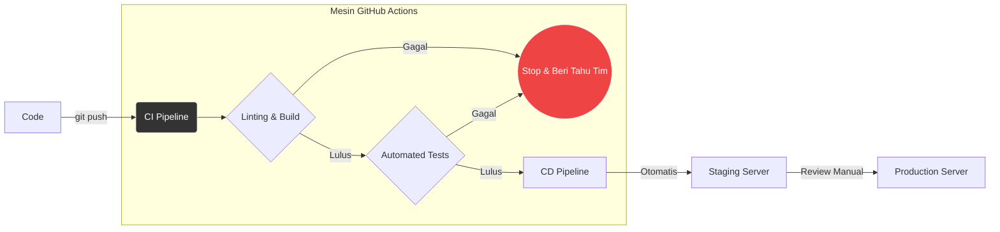

Jika ada satu jurang pemisah terbesar antara *Junior Developer* dan *Senior Developer*, itu adalah proses "Rilis" (Deployment). Seorang Junior biasanya merilis kode dengan mem-build secara lokal di laptopnya, lalu me-remote server via FTP atau SSH, menimpa file lama, merestart aplikasi secara manual, lalu berdoa agar aplikasinya tidak *crash*.

Di perusahaan profesional modern, hal tersebut sangat dilarang. Kita menggunakan sebuah paradigma bernama **CI/CD (Continuous Integration & Continuous Deployment/Delivery)**. Modul ini akan membongkar rahasia mesin otomatisasi di balik rilis aplikasi miliaran dolar.

## 1. Memahami Konsep DevOps dan CI/CD

DevOps (Development & Operations) bukanlah sebuah alat, melainkan sebuah budaya. Tujuannya satu: Memperpendek jarak dan waktu antara "Programmer menulis baris kode" hingga "Kode tersebut dinikmati oleh Pengguna akhir", namun dengan keandalan (*Reliability*) yang mutlak. CI/CD adalah mesin penggerak utama DevOps.

### Continuous Integration (CI) - "Integrasi Berkelanjutan"
Praktik di mana beberapa programmer menggabungkan kode baru mereka ke *repository* utama (seperti `main` branch di GitHub) **sesering mungkin** (bisa berkali-kali dalam sehari).
- **Proses CI:** Setiap kali seorang programmer melakukan `git push` atau membuat *Pull Request* (PR), mesin di *cloud* (seperti GitHub Actions) akan secara otomatis mengunduh kode tersebut, menjalankan semua unit test (pengujian otomatis), mengecek format kode (Linting), dan memastikan tidak ada *error* kompilasi.
- **Goal:** Menemukan *bug* sejak detik pertama kode dibuat, BUKAN pada saat kode sudah sampai di tangan pengguna.

### Continuous Deployment (CD) - "Penyebaran Berkelanjutan"
Jika proses CI lulus 100% (semua *test* berwarna hijau), maka fase CD mengambil alih.
- **Proses CD:** Mesin akan secara otomatis membungkus aplikasi tersebut (misal: membangun Docker Image, lihat Modul 20), mengirimkannya ke server produksi, lalu mematikan *container* yang lama dan menyalakan *container* yang baru secara perlahan tanpa gangguan (*Zero-Downtime Deployment*).
- **Goal:** Menghilangkan campur tangan manusia dalam proses rilis. Manusia bisa melakukan kesalahan ketik, mesin tidak.



## 2. Mengenal GitHub Actions

Ada banyak alat CI/CD di pasaran (Jenkins, GitLab CI, CircleCI), namun **GitHub Actions** telah menjadi standar industri *de facto* karena letaknya yang menyatu langsung dengan *repository* kode (GitHub).

Setiap kali terjadi suatu **Event** (kejadian) di repositori Anda—misalnya ada yang melakukan `push` ke branch `main`, atau ada yang membuat `Pull Request` baru—GitHub Actions akan memicu sebuah **Workflow** (alur kerja) yang Anda definisikan dalam format file `.yaml`.

## 3. Menulis Workflow Pertama Anda (Automated Testing)

File *workflow* harus diletakkan persis di dalam folder rahasia: `.github/workflows/`.

Mari kita buat sebuah *pipeline* CI sederhana untuk proyek React/Next.js. Kita akan menamainya `ci.yml`.

```yaml
# File: .github/workflows/ci.yml
name: Pengujian Otomatis (CI)

# Kapan workflow ini harus dijalankan? (EVENTS)
on:
  push:
    branches: [ "main" ] # Jalan saat ada push ke branch main
  pull_request:
    branches: [ "main" ] # Jalan saat ada Pull Request ke branch main

jobs:
  # Nama tugas (Job)
  build-and-test:
    # Komputer virtual apa yang akan GitHub sewa untuk kita?
    runs-on: ubuntu-latest

    # Langkah-langkah detail yang harus dijalankan mesin (STEPS)
    steps:
      # 1. Klon kode (Download dari Github ke mesin Ubuntu virtual)
      - name: Checkout Kode Repositori
        uses: actions/checkout@v4

      # 2. Pasang Node.js di mesin virtual tersebut
      - name: Setup Node.js versi 20
        uses: actions/setup-node@v4
        with:
          node-version: '20'
          cache: 'npm' # Optimasi agar npm install lebih cepat

      # 3. Instal dependencies
      - name: Install dependencies
        run: npm ci

      # 4. Cek kerapihan kode (Lint)
      - name: Jalankan ESLint
        run: npm run lint

      # 5. Jalankan Unit Test
      - name: Jalankan Pengujian (Testing)
        run: npm run test

      # 6. Pastikan kode bisa dibuild
      - name: Build Aplikasi
        run: npm run build
```

**Bagaimana Membacanya?**
Bayangkan GitHub menyewakan sebuah laptop kosong dengan OS Ubuntu kepada Anda secara gratis selama beberapa menit. Skrip YAML di atas adalah instruksi persis apa yang harus Anda ketikkan di terminal laptop kosong tersebut. Jika ada satu saja perintah (`run`) yang gagal (misal: ada *test* yang gagal), maka seluruh proses akan berhenti dengan status X merah. *Pull Request* tidak akan diizinkan untuk di-merger oleh *Engineering Manager*.

## 4. Pipeline Continuous Deployment (Pengiriman Otomatis)

Mari kita asumsikan kita punya Server VPS (seperti DigitalOcean) dan ingin agar kode yang baru kita gabungkan (merge) ke branch `main` langsung diunggah dan dirilis di server tersebut secara otomatis.

Ini adalah bentuk CD klasik menggunakan SSH.

```yaml
# File: .github/workflows/cd.yml
name: Rilis ke Produksi (CD)

# Hanya jalan jika kode benar-benar sudah masuk (push) ke main
on:
  push:
    branches: [ "main" ]

jobs:
  deploy:
    runs-on: ubuntu-latest
    
    # Kunci Keamanan! Jangan pernah menulis password di sini
    steps:
      - name: Eksekusi Skrip via SSH ke Server
        uses: appleboy/ssh-action@v1.0.3
        with:
          host: ${{ secrets.SERVER_IP }}
          username: ${{ secrets.SERVER_USER }}
          key: ${{ secrets.SSH_PRIVATE_KEY }}
          # Perintah terminal yang dijalankan DI DALAM server VPS kita
          script: |
            cd /var/www/aplikasi-saya
            git pull origin main
            npm ci
            npm run build
            pm2 restart my-app
```

### Keamanan: GitHub Secrets
Di skrip CD di atas, Anda melihat variabel seperti `${{ secrets.SERVER_IP }}`. Ini sangat penting. Anda tidak boleh menaruh Alamat IP Server apalagi Password/Private Key SSH langsung di dalam file kode sumber yang bisa dibaca publik (bahkan oleh anggota tim lain).

Di menu "Settings" repositori GitHub Anda, terdapat bagian "Secrets and variables" -> "Actions". Di sanalah Anda mengisikan kunci rahasia ini. Saat mesin GitHub mengeksekusi skrip, ia akan mengganti variabel tersebut dengan kunci aslinya secara ajaib, dan bahkan menyensornya di layar log agar tidak ada admin yang bisa mengintip password Anda.

## Kesimpulan

Otomatisasi merubah Anda dari seseorang yang "bekerja keras" menjadi seseorang yang "bekerja cerdas". Dengan CI/CD:
1. **Developer lebih tenang:** Tidak ada lagi rasa takut saat hari Jumat sore, karena Anda tahu jika kode Anda mengandung *bug*, pipeline CI akan mencegahnya masuk ke *production*.
2. **Kualitas Meningkat:** Semua tes dijalankan tanpa terkecuali, memaksa seluruh tim untuk menulis kode yang lolos pengujian.
3. **Fokus pada Nilai:** Alih-alih menghabiskan waktu 30 menit mengurus proses rilis setiap harinya, waktu tersebut bisa dipakai untuk merancang fitur baru.

*Workflow* YAML di atas memang tampak menyeramkan pada awalnya, namun begitu Anda menyiapkannya satu kali, ia akan melayani Anda dan tim Anda hingga ribuan kali *push* ke depan. Selamat datang di liga profesional.
