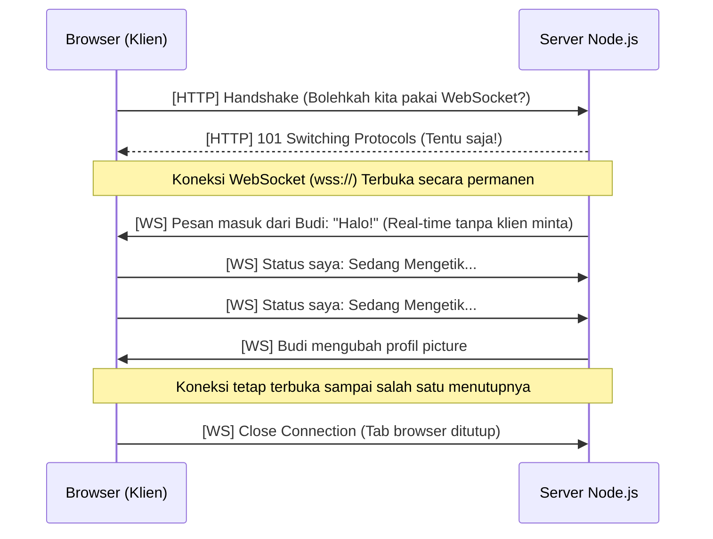

Selama ini, kita telah belajar bahwa web beroperasi pada protokol komunikasi bernama HTTP (HyperText Transfer Protocol). Dalam model HTTP tradisional, ada aturan mutlak: **Server tidak bisa berbicara kepada Klien (Browser), kecuali Klien bertanya lebih dulu.**

Bayangkan Anda memesan makanan di restoran.
- Model HTTP: Anda (Klien) harus berteriak bertanya ke dapur (Server) setiap 5 menit: "Apakah pesanan saya sudah siap?". Jika dapur bilang "Belum", Anda harus terus mengulang pertanyaan tersebut terus menerus. Proses melelahkan ini disebut **HTTP Polling**.

Model ini sangat tidak efisien untuk aplikasi masa kini. Jika Anda membuat aplikasi *chat* seperti WhatsApp menggunakan HTTP, setiap HP pengguna di seluruh dunia harus terus bertanya "Apakah ada pesan baru?" setiap detik ke server Meta. Server akan meledak kelebihan beban karena 99% dari jutaan pertanyaan tersebut jawabannya adalah "Tidak ada pesan baru".

Solusinya? Selamat datang di dunia **WebSocket**.

## 1. Bagaimana WebSocket Bekerja?

WebSocket adalah protokol komunikasi yang memecahkan masalah HTTP dengan menyediakan **Koneksi Dua Arah Secara Terus-Menerus** (Full-Duplex Persistent Connection).

Kembali ke analogi restoran:
- Model WebSocket: Anda memesan makanan, lalu pramusaji memberikan Anda sebuah alat *pager* yang diletakkan di meja Anda. Anda bisa duduk diam dengan tenang. Saat makanan siap, dapur (Server) yang akan menekan tombol sehingga *pager* Anda berbunyi (Server proaktif mengirimkan data ke Klien).



**Karakteristik WebSocket:**
1. Menggunakan protokol `ws://` atau `wss://` (untuk versi aman terenkripsi).
2. Setelah *handshake* awal (jabat tangan awal menggunakan HTTP), koneksi akan tetap "Terbuka". Tidak perlu mengirimkan informasi berulang seperti *Headers* atau *Cookies* setiap kali mengirim pesan.
3. Ini menghasilkan *latency* (keterlambatan) yang nyaris nol milidetik. Sangat krusial untuk game *multiplayer*, papan saham (*trading*), atau *live streaming*.

## 2. Membangun Aplikasi Chat dengan Socket.io

Menulis kode WebSocket mentah menggunakan pustaka bawaan browser sebenarnya cukup rumit, terutama ketika Anda harus berurusan dengan masalah putus koneksi (misal pengguna masuk terowongan sehingga sinyal HP hilang).

Untuk itulah komunitas JavaScript menciptakan **Socket.io**. Ini adalah *library* standar industri yang sangat tangguh. Ia membungkus kerumitan WebSocket dan secara otomatis menyediakan fitur "Sambung Ulang Otomatis" (*Auto-Reconnection*) jika koneksi terputus sesaat.

Mari kita lihat struktur kode backend Node.js untuk membuat sebuah Ruang Obrolan (*Chatroom*) global yang paling sederhana.

### Kode Sisi Server (Backend Node.js)
```javascript
// file: server.js
const { Server } = require("socket.io");
const http = require("http");
const express = require("express");

const app = express();
const server = http.createServer(app);

// Inisialisasi Socket.io
const io = new Server(server, {
  cors: { origin: "*" } // Izinkan klien dari mana saja
});

// Event Listener: Ketika ada user baru yang konek
io.on("connection", (socket) => {
  console.log(`User terkoneksi dengan ID unik: ${socket.id}`);

  // Event Listener: Menunggu klien mengirim pesan (event "pesan_baru")
  socket.on("pesan_baru", (data) => {
    console.log(`Pesan diterima dari ${data.username}: ${data.pesan}`);
    
    // BROADCAST: Lempar pesan ini ke SEMUA orang yang terkoneksi
    io.emit("terima_pesan", {
      username: data.username,
      pesan: data.pesan,
      waktu: new Date().toISOString()
    });
  });

  // Event Listener: Ketika user menutup browser
  socket.on("disconnect", () => {
    console.log(`User ${socket.id} terputus`);
  });
});

server.listen(3001, () => {
  console.log("Server Chat menyala di port 3001");
});
```

### Kode Sisi Klien (Frontend React / Next.js)
Di sisi React, kita menggunakan *hook* `useEffect` untuk mendengarkan kejadian dari server secara terus menerus.

```tsx language-typescript
// file: ChatRoom.tsx
"use client"; // Jangan lupa ini adalah Client Component!

import { useState, useEffect } from 'react';
import { io } from 'socket.io-client';

// Hubungkan ke server kita!
const socket = io('http://localhost:3001');

export default function ChatRoom() {
  const [pesanInput, setPesanInput] = useState('');
  const [daftarPesan, setDaftarPesan] = useState<{username: string, pesan: string}[]>([]);

  useEffect(() => {
    // Dengarkan event "terima_pesan" dari server
    socket.on('terima_pesan', (data) => {
      // Masukkan pesan baru ke dalam array state kita
      setDaftarPesan((prev) => [...prev, data]);
    });

    // Cleanup: Matikan pendengar jika komponen di unmount
    return () => {
      socket.off('terima_pesan');
    };
  }, []);

  const kirimPesan = (e: React.FormEvent) => {
    e.preventDefault();
    if (!pesanInput) return;

    // Tembak pesan ke Server!
    socket.emit('pesan_baru', {
      username: 'UserMisterius', // Hardcode sementara
      pesan: pesanInput
    });
    
    setPesanInput(''); // Kosongkan input
  };

  return (
    <div className="p-4 max-w-md mx-auto border rounded shadow-lg">
      <h2 className="text-2xl font-bold mb-4">Live Chat</h2>
      
      {/* Area Tampilan Pesan */}
      <div className="h-64 overflow-y-auto mb-4 p-2 bg-gray-100 rounded">
        {daftarPesan.map((msg, index) => (
          <div key={index} className="mb-2 text-black">
            <strong>{msg.username}:</strong> {msg.pesan}
          </div>
        ))}
      </div>

      {/* Form Ketik Pesan */}
      <form onSubmit={kirimPesan} className="flex gap-2">
        <input 
          value={pesanInput}
          onChange={(e) => setPesanInput(e.target.value)}
          className="flex-1 border p-2 rounded text-black"
          placeholder="Ketik pesan..."
        />
        <button type="submit" className="bg-blue-600 text-white px-4 rounded">
          Kirim
        </button>
      </form>
    </div>
  );
}
```

Jika Anda membuka file kode klien di atas di dua tab browser yang berbeda, Anda akan melihat keajaibannya. Saat Anda mengetik di Tab A dan menekan enter, pesan akan seketika muncul di Tab B tanpa *loading* sama sekali.

## 3. Skalabilitas WebSocket (Pub/Sub)

Masalah terbesar dari WebSocket adalah ketika aplikasi Anda memiliki 1 juta pengguna. Satu server Node.js mungkin hanya kuat menahan 10.000 koneksi WebSocket yang terbuka secara bersamaan, karena setiap koneksi memakan RAM server.

Anda (sebagai *Architect*) memutuskan untuk menambah Server Chat menjadi 5 server (Horizontal Scaling).
- Pengguna A terhubung ke Server 1.
- Pengguna B terhubung ke Server 2.

Jika Pengguna A mengirim pesan ke grup, Server 1 hanya tahu cara mengirim *broadcast* ke pengguna-pengguna yang terkoneksi langsung dengannya. Pengguna B di Server 2 tidak akan pernah menerima pesan tersebut!

Solusinya adalah menggunakan arsitektur **Pub/Sub (Publish/Subscribe)** dengan bantuan **Redis**.

Redis Adapter (di Socket.io) bertindak sebagai jembatan. 
Setiap kali Server 1 menerima pesan, selain mengirim ke pengguna lokalnya, Server 1 juga akan "Publish" (mengumumkan) pesan tersebut ke Redis. 
Server 2 yang mendengarkan (Subscribe) pada Redis, akan menangkap pengumuman tersebut dan menyebarkannya kembali ke pengguna-penggunanya (termasuk Pengguna B).

## Kesimpulan

WebSocket adalah pedang bermata dua. Ia menawarkan UX (*User Experience*) terbaik yang seakan-akan hidup. Namun, mengelola koneksi yang terbuka secara permanen jauh lebih sulit daripada mengelola API HTTP biasa (REST/GraphQL). 
Sangat tidak disarankan menggunakan WebSocket jika interaksi hanya terjadi sesekali (misal: mengambil daftar artikel). Gunakan WebSocket secara eksklusif untuk fitur-fitur waktu nyata (*Real-time*) seperti Kolaborasi Dokumen Live, Notifikasi Peringatan Instan, atau Sistem Chatting.
