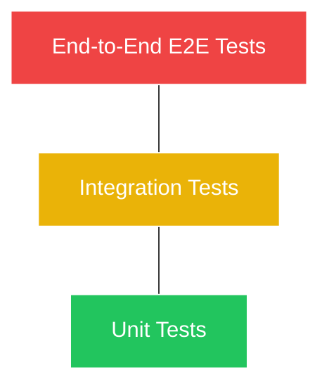

Mari kita jujur: Mengapa banyak *developer* benci merilis aplikasi pada hari Jumat sore? Jawabannya sederhana: Karena mereka takut kodenya merusak sesuatu, dan akhir pekan mereka akan hancur untuk memperbaiki *bug* (Bug-fixing).

Di tingkat profesional, Anda tidak lagi "menguji" aplikasi dengan cara mengklik tombol-tombol di browser Anda secara manual puluhan kali setiap kali Anda menambahkan fitur baru. Anda akan menulis **Kode yang bertugas menguji Kode Anda yang lain**. Ini disebut *Automated Testing*.

## 1. Piramida Pengujian (The Testing Pyramid)

Konsep paling dasar dalam strategi pengujian adalah "Piramida Pengujian". Ini adalah pedoman industri tentang rasio jenis tes apa yang harus Anda tulis.



Piramida tersebut menjelaskan hal ini:
- **Bagian Bawah (Lebar & Hijau) - Unit Tests:** Harus sangat banyak. Dieksekusi secepat kilat (milidetik). Meliputi dasar dari setiap fungsi kecil di kode Anda.
- **Bagian Tengah (Kuning) - Integration Tests:** Jumlahnya moderat. Menguji bagaimana dua atau tiga komponen kecil (misal: Fungsi Login dengan Database) bisa bekerja sama dengan baik.
- **Bagian Puncak (Merah & Sempit) - E2E Tests:** Jumlahnya sedikit (hanya untuk alur paling krusial). Sangat lambat dan rapuh, karena ia benar-benar membuka peramban (Chrome/Firefox) secara ajaib dan mensimulasikan klik kursor pengguna.

Mari kita bahas lapisan-lapisan tersebut secara praktikal.

## 2. Unit Testing (Pengujian Unit) dengan Jest

Unit Testing adalah pengujian unit terkecil dari perangkat lunak (biasanya menguji satu buah Fungsi/Fungsi *Pure*). Jika fungsi Anda adalah mesin cuci, Unit Testing bertugas memastikan tombol "On" benar-benar menyala ketika ditekan, tanpa mempedulikan apakah bajunya bersih atau tidak.

Alat yang paling populer digunakan adalah **Jest** atau **Vitest**.

**Contoh Sederhana:**
Bayangkan Anda memiliki fungsi utilitas untuk menghitung diskon.

```javascript
// file: math.js
export function hitungDiskon(hargaAwal, persentase) {
  if (persentase < 0 || persentase > 100) return hargaAwal;
  return hargaAwal - (hargaAwal * (persentase / 100));
}
```

Sebagai seorang *Engineer*, Anda akan menulis file pengujiannya:

```javascript
// file: math.test.js
import { hitungDiskon } from './math';

describe('Fungsi hitungDiskon', () => {
  // Test Case 1: Normal
  test('harus menghitung diskon 50% dengan benar', () => {
    // Assert (Pastikan bahwa hasilnya sesuai harapan)
    expect(hitungDiskon(100000, 50)).toBe(50000);
  });

  // Test Case 2: Edge Case (Kasus Ekstrem)
  test('tidak merubah harga jika diskon di atas 100%', () => {
    expect(hitungDiskon(100000, 150)).toBe(100000); // Harus ditolak fungsinya
  });
});
```

Hanya dengan mengetik `npm test` di terminal, mesin akan menjalankan ribuan fungsi pengujian ini dalam hitungan milidetik. Jika esok hari kolega Anda merubah kode `math.js` dan tanpa sengaja merusak rumusnya, perintah `npm test` akan mengeluarkan tulisan merah besar sebelum kode tersebut sempat naik ke *production*.

### Mocking (Pemalsuan)
Bagaimana jika fungsi Anda mengambil data dari API eksternal (seperti API Cuaca)? Kita tentu tidak ingin "Unit Test" kita gagal hanya karena API Cuaca kebetulan sedang *down*. Unit Test tidak boleh bergantung pada jaringan internet.

Di sinilah kita menggunakan teknik **Mocking**. Kita "memalsukan" respons API tersebut agar selalu mengembalikan nilai statis. Jika Anda bisa menguasai teknik "Mocking", Anda sudah menguasai 80% seni menulis *Unit Test*.

## 3. End-to-End (E2E) Testing dengan Playwright

Unit Test memastikan fungsi `hitungDiskon` bekerja. Integration Test memastikan `hitungDiskon` tersambung ke `KatalogDatabase`. Tetapi hanya **End-to-End Test (E2E)** yang memastikan bahwa ketika manusia seutuhnya mengetik di kolom pencarian, mengklik produk, mengisi alamat pengiriman, dan menekan tombol Beli, uangnya benar-benar berpindah!

Di E2E, kode tidak melihat fungsi-fungsi JavaScript. Ia mengontrol "Robot Browser" layaknya hantu yang menggerakkan *mouse* di layar Anda.

Saat ini, juara bertahan untuk alat E2E adalah **Playwright** (buatan Microsoft) dan **Cypress**.

**Contoh Skrip Playwright untuk Alur Login:**
```typescript language-typescript
import { test, expect } from '@playwright/test';

// Mesin akan membuka tab browser tersembunyi
test('Pengguna bisa berhasil login dan melihat Dashboard', async ({ page }) => {
  // 1. Kunjungi halaman utama
  await page.goto('https://websitekita.com/login');

  // 2. Cari kolom input berdasarkan tulisan di UI dan isi data
  await page.getByPlaceholder('Masukkan Email').fill('admin@test.com');
  await page.getByPlaceholder('Password').fill('rahasia123');

  // 3. Klik tombol Login
  await page.getByRole('button', { name: 'Masuk Sekarang' }).click();

  // 4. Assert: Tunggu URL berubah dan pastikan ada teks "Selamat Datang"
  await expect(page).toHaveURL(/.*dashboard/);
  await expect(page.getByText('Selamat Datang, Admin!')).toBeVisible();
});
```

Tes ini luar biasa kuat, tapi sangat rapuh. Jika Anda merubah warna tombol dan membuat tombol itu sedikit keluar jalur sehingga tidak terlihat (*hidden*) di layar HP, robot Playwright akan melaporkan bahwa tes Gagal, karena ia melihat dari sudut pandang manusia.

Itulah mengapa E2E Test letaknya di Puncak Piramida (Jumlahnya sedikit). Terlalu banyak E2E test akan membuat waktu *Build* CI/CD (Modul 21) Anda dari yang tadinya 5 menit membengkak menjadi 2 jam.

## 4. Test-Driven Development (TDD)

TDD bukanlah sebuah alat, ia adalah filosofi alur kerja. TDD membalik cara pandang tradisional: Anda harus **menulis Kode Pengujian (Test) TERLEBIH DAHULU**, sebelum Anda menulis satu baris pun kode aplikasinya!

Alurnya (RED - GREEN - REFACTOR):
1. **RED:** Anda menulis file tes (`math.test.js`). Anda menjalankannya. Tentu saja ia Gagal Merah, karena fungsi `hitungDiskon` bahkan belum Anda buat sama sekali.
2. **GREEN:** Anda menulis kode fungsi `hitungDiskon` sesederhana mungkin **HANYA** demi membuat layar tes berubah jadi Hijau (Lulus).
3. **REFACTOR:** Setelah Hijau, Anda bebas mempercantik kodenya, merapikan strukturnya, dengan perasaan aman 100% karena Anda sudah dikawal oleh Tes Hijau tersebut.

TDD sangat sulit dipraktikkan oleh pemula karena memaksa otak untuk berpikir "Apa hasil akhirnya nanti?" sebelum menulis kode. Namun di tim *Enterprise* dan *Open Source*, ini adalah pola kerja yang sangat dihargai.

## Kesimpulan

Banyak perusahaan tidak melakukan pengujian otomatis karena alasan "Kami tidak punya waktu, lebih baik fitur cepat rilis."
Namun, hutang teknis (*Technical Debt*) itu akan ditagih nantinya. Hari-hari yang seharusnya dipakai untuk membuat fitur baru, akan habis dipakai untuk menginvestigasi mengapa fitur lama tiba-tiba mogok kerja.

Menulis *Automated Testing* bukanlah biaya tambahan. Ia adalah asuransi jiwa bagi kestabilan mental Anda sebagai seorang *Software Engineer*. Dengan tes yang lengkap (Coverage tinggi), Anda bisa me-refactor ribuan baris kode lama pada hari Jumat pukul 16:30, lalu pulang dan tidur sangat nyenyak tanpa rasa khawatir.
