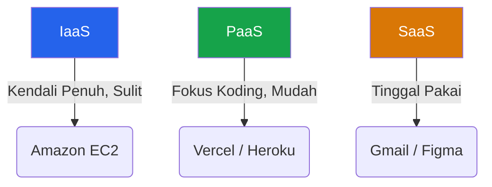

Di awal karir pembuatan web, kita biasanya menyewa *Shared Hosting* (seperti cPanel seharga Rp 50.000/bulan) untuk mengunggah file PHP dan HTML kita. Ketika trafik mulai naik dan kita menggunakan Node.js, kita pindah ke VPS (Virtual Private Server) seperti DigitalOcean atau Linode seharga $5/bulan. 

Namun, bagaimana dengan Netflix yang memiliki server penyandian video yang berjalan di siang hari, tapi tidak dibutuhkan di malam hari saat pengguna tidur? Menyewa ratusan VPS yang menganggur di malam hari berarti membakar jutaan dolar secara sia-sia.

Inilah mengapa Amazon (dengan AWS-nya) dan Google (GCP) mengubah wajah dunia teknologi dengan melahirkan **Cloud Computing Modern**.

## 1. Definisi Cloud Computing (Komputasi Awan)

Cloud Computing secara harfiah berarti: *Meminjam komputer orang lain via internet, dan hanya membayar persis sebesar apa yang Anda gunakan.*

Konsep utamanya adalah **Elasticity (Elastisitas)**.
- Di VPS biasa, Anda menyewa server dengan RAM 4GB. Jika aplikasi Anda butuh 8GB, Anda harus merestart server dan mengubah paket langganan.
- Di Cloud, Anda bisa mengatur agar di jam 12 siang (jam sibuk), sistem otomatis melipatgandakan server Anda menjadi 10 buah, dan di jam 1 pagi (sepi), sistem menghancurkan 9 server tersebut dan hanya menyisakan 1. Uang Anda selamat.

## 2. Piramida Layanan Cloud (IaaS, PaaS, SaaS)

Untuk menghindari kebingungan, layanan Cloud selalu dibagi menjadi 3 kategori besar yang membentuk piramida dari yang paling sulit (tapi bebas) hingga yang paling mudah (tapi terkekang).

### A. IaaS (Infrastructure as a Service)
Contoh: Amazon EC2, Google Compute Engine.

Anda menyewa kepingan "Besi" virtual (CPU, RAM, Hardisk, dan Jaringan Internet).
- **Tugas Anda:** Menginstal Sistem Operasi (Linux/Windows), mengatur Firewall keamanan, menginstal Node.js, Docker, memastikan server selalu di-update agar tidak di-hack.
- **Tugas Cloud Provider:** Memastikan listrik gedung mereka menyala dan kabel internet tidak putus.
- **Kelebihan:** Sangat murah dan kontrol absolut (100% kendali).

### B. PaaS (Platform as a Service)
Contoh: Vercel, Heroku, AWS Elastic Beanstalk.

Anda tidak perlu peduli dengan Sistem Operasi atau "Besi" di baliknya. Anda hanya diberikan sebuah "Panggung" siap pakai.
- **Tugas Anda:** Menulis kode aplikasi dengan baik, dan melakukan `git push`.
- **Tugas Cloud Provider:** Menginstal Node.js, mengatur Load Balancer (Modul 18), mengamankan OS dari peretas, menaikkan/menurunkan jumlah server secara otomatis sesuai *traffic*.
- **Kelebihan:** Fokus 100% pada penulisan kode tanpa pusing memikirkan manajemen server (DevOps). Tentu saja, harganya jauh lebih mahal dari IaaS.

### C. SaaS (Software as a Service)
Contoh: Google Workspace (Gmail/Drive), Figma, Salesforce.

Anda sama sekali tidak menyentuh kode. Anda bertindak sebagai pengguna akhir yang langsung menggunakan produk perangkat lunak lewat *browser* Anda dengan sistem berlangganan.

## 3. Ekosistem AWS (Amazon Web Services)

Sebagai *Engineer*, Anda **wajib** mengetahui setidaknya nama-nama layanan pilar dari AWS, karena mereka menguasai sekitar 30% pangsa pasar internet global. Bahkan nama layanan mereka kini menjadi bahasa komunikasi standar antar *developer*.

*Berikut adalah Layanan Pilar AWS yang harus Anda hafal konsepnya:*

1. **EC2 (Elastic Compute Cloud):** Ini adalah IaaS. Komputer virtual murni (VPS). Anda pakai EC2 untuk menjalankan Docker Container atau aplikasi Node.js manual.
2. **S3 (Simple Storage Service):** Gudang penyimpanan *file* tak terbatas. Jangan pernah menyimpan file gambar/video pengguna (*User Uploads*) di dalam Hardisk EC2 Anda, karena jika server mati, gambar hilang. Simpanlah semua gambar di S3. S3 sangat murah dan tidak akan pernah penuh.
3. **RDS (Relational Database Service):** Database PostgreSQL/MySQL yang di-manage oleh Amazon. Amazon yang akan mengurus *backup* harian, replikasi data ke benua lain, dan keamanan OS database-nya.
4. **CloudFront:** Ini adalah CDN (Content Delivery Network). Jika Anda meletakkan gambar Anda di server Amerika, *user* di Indonesia akan butuh waktu 3 detik untuk mengunduhnya. CloudFront membuat salinan (*cache*) dari gambar tersebut dan meletakkannya di gedung server Amazon cabang Jakarta, sehingga *user* Indonesia bisa memuatnya dalam 0.1 detik.

## 4. Revolusi Serverless (Komputasi Tanpa Server)

Istilah *Serverless* adalah puncak rantai evolusi *Cloud Computing*. Namanya mengecoh, karena sebenarnya *tetap ada* server fisik di baliknya, hanya saja Anda sebagai pengembang benar-benar **tidak perlu** mengurus, menyewa, atau bahkan mengetahui di mana server itu berada.

Layanan pelopor di bidang ini adalah **AWS Lambda**.

### Cara Kerja Serverless:
Di arsitektur tradisional, server Node.js/Express Anda harus menyala 24 jam x 7 hari, meskipun tidak ada pengguna yang mengunjungi website Anda dari jam 1 pagi hingga 5 pagi. Anda tetap harus membayar biaya sewa server untuk durasi tersebut.

Pada arsitektur *Serverless*, Anda tidak menjalankan aplikasi. Anda hanya mengunggah **satu buah fungsi JavaScript** (misal fungsi `ResizeImage()`).
- Saat tidak ada yang menggunakan, fungsi itu tidur (Anda membayar **Rp 0**).
- Tiba-tiba di siang hari ada pengguna yang mengklik tombol. AWS secara ajaib akan menghidupkan komputer mikro dalam 0.05 detik, menjalankan fungsi `ResizeImage()` Anda, dan segera mematikan komputernya kembali.
- Anda hanya ditagih biaya komputasi untuk durasi eksekusi kode Anda (misal: Anda ditagih uang untuk 0.8 detik). Jika eksekusi selesai, argo tagihan berhenti.

**Serverless adalah konsep mutlak di balik framework seperti Next.js (Server Actions) dan Vercel (Edge Functions).** Setiap Endpoint API (Route Handlers) yang Anda buat di Next.js akan dikompilasi menjadi satu fungsi Lambda terpisah yang independen.

## Kesimpulan

*Cloud Computing* memisahkan para "Tukang Kode" dari "Insinyur Sistem". Mengetahui cara merakit lego (layanan Cloud) adalah kunci untuk membangun startup yang bisa bermutasi dari 10 pengguna di hari pertama, menjadi 10 Juta pengguna di bulan kedua tanpa perlu merombak ulang kodenya.

Jika Anda baru memulai, mulailah dengan PaaS (seperti Vercel atau Supabase) yang menyembunyikan kerumitan Cloud. Ketika perusahaan tempat Anda bekerja sudah memiliki skala ekonomi raksasa, barulah Anda bermanuver mengorkestrasi IaaS AWS mentah untuk menekan biaya tagihan bulanan secara efisien.
